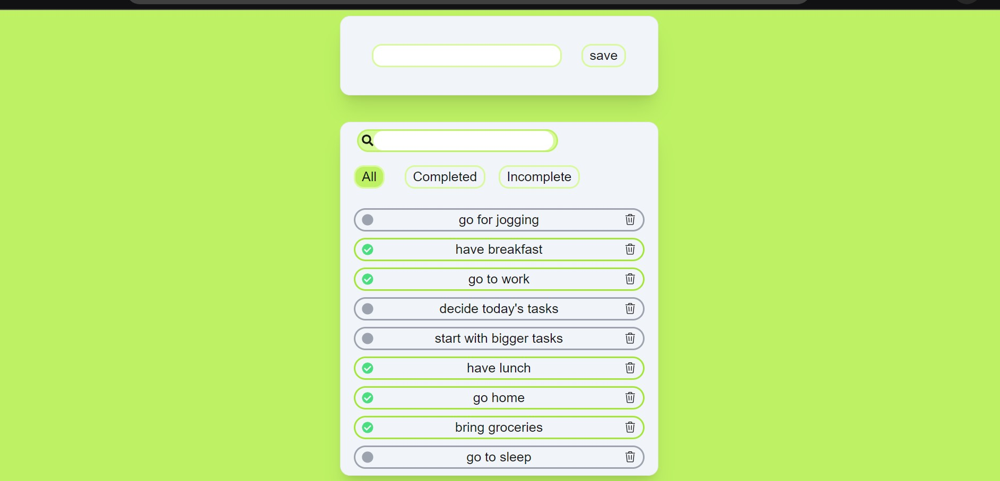

# Todo App

A simple Todo application that allows users to add, delete, and search through their todos. This application utilizes React components for a clean and interactive user experience.

## Table of Contents

- [Features](#features)
- [Technologies](#technologies)
- [Getting Started](#getting-started)
- [Usage](#usage)
- [Contributing](#contributing)
- [License](#license)

## Features

- **Add Todos**: Users can add new todos to their list.
- **Delete Todos**: Users can remove todos from the list.
- **Search Functionality**: Users can search for specific todos in real-time.

## Technologies

- **Next.js**: A React framework for building server-rendered applications.
- **React**: A JavaScript library for building user interfaces.
- **TypeScript**: A superset of JavaScript that adds static types.
- **CSS**: For styling the components.

## Getting Started

To get started with this project, follow these steps:

1. **Clone the repository**:  
   git clone https://github.com/abhi-math/todo-app

2. **install node dependencies**:  
   npm i

3. **Run the project**:  
   npm run dev

Open [http://localhost:3000](http://localhost:3000) with your browser to see the result.

